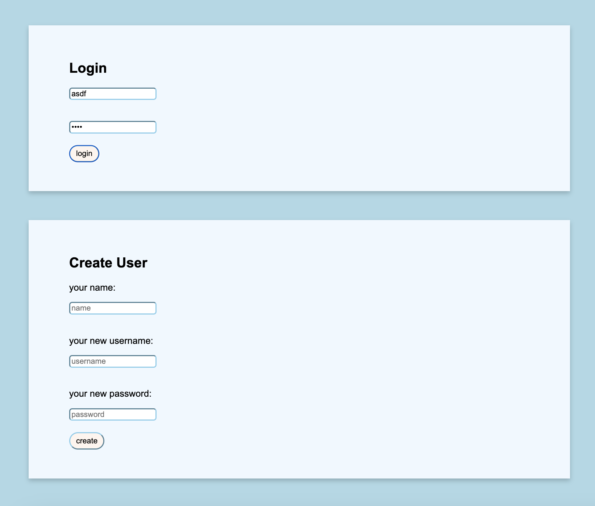
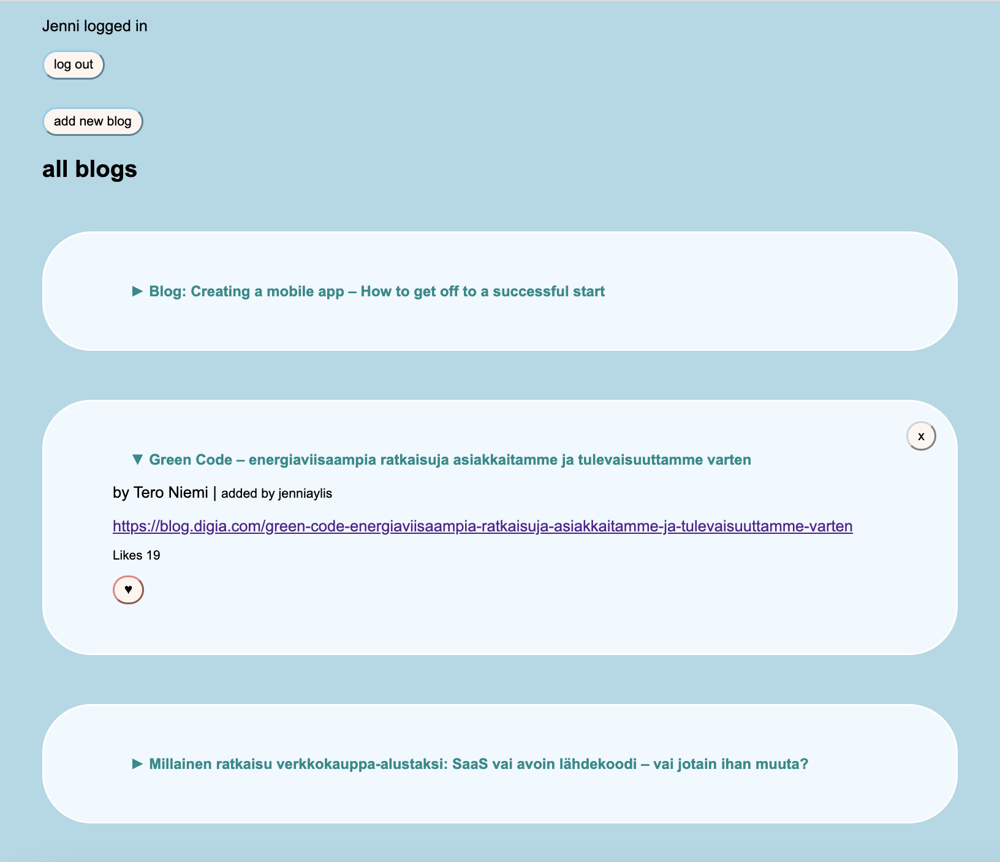
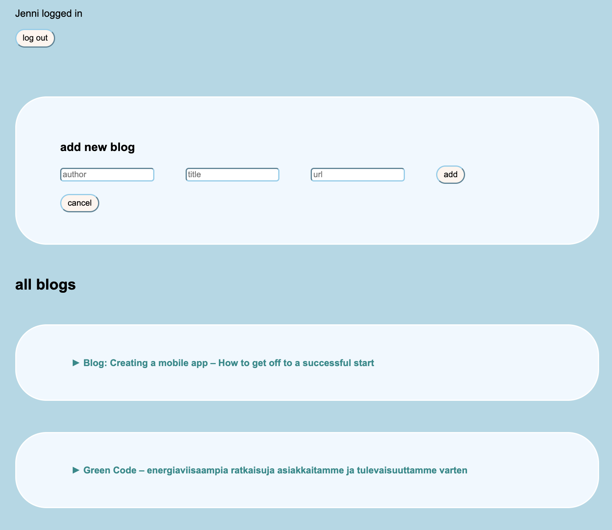

# Testing React apps

In this part, I learned
- more possibilities for testing React code (unit testing with jest and react testing library, and end-to-end testing with cypress)
- to implement token based authentication which will enable users to log in to our application

:bangbang: This app is not deployed to the internet. Everything is working nice and smooth in localhost, though.

## BlogList App is looking like this

Database: MongoDB

First, user has to login:

After succesful login, bloglist is visible for the user:

User can add new blog by clicking the button with text "add new blog", and this form opens up for the user:

Blogs can be liked and deleted (delete button is rendered only for those blogs that are added by the user who is logged in, so no other user can delete blog than the blog adder).

Blogs are sorted by likes: most liked blog is first on the list.

The user can view/ unview more details about a blog in the list by clicking the blog title.

Bugs (what I have noticed, could be more):

- when like button is clicked many times, blog adder disappears (but can be viewed again if the page is refreshed)
- when user adds new blog to the list, the new blog is rendered after 5 seconds (I had problem with rendering the notification at the same time)

Todo (ideas how this app could be developed further):

- dropdown menu with sort options (e.g. alphabetical order, newest first order etc)
- search field for user to search a specific blog
- user wouldnt be able to add same blog twice or many times
- notifications (success/ fail/ error) for create user card
- pagination so that 10 blogs is rendered at a time
- functionality: blogs could be shared through other platforms